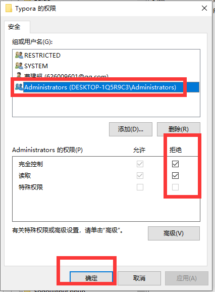

# Typora运行报错

在Typora中出现了问题：

this beta version of typora is expired。

参考文献：https://blog.csdn.net/weixin_46599926/article/details/126041944

解决方案：

1、win+R输入regedit打开注册表

​    

2、在 计算机\HKEY_CURRENT_USER\SOFTWARE 中找到 Typora 文件夹。

​    

3、右键 Typora 文件夹，打开 修改权限，将所有用户的 完全控制 和 读取 权限勾选为拒绝，然后点击 应用 即可

​    

​    